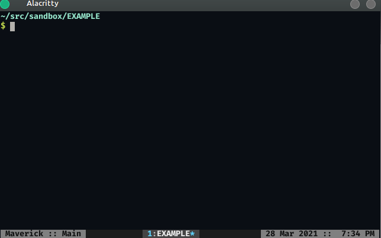

# coc-jedi

[](https://www.npmjs.com/package/coc-jedi)
[](https://www.npmjs.com/package/coc-jedi)
[](https://python.org/pypi/jedi-language-server)
[](https://www.npmjs.com/package/coc-jedi)
[](https://www.npmjs.com/package/coc-jedi)
[](https://python.org/pypi/jedi-language-server)

[coc.nvim](https://github.com/neoclide/coc.nvim) wrapper for Python's [jedi-language-server](https://github.com/pappasam/jedi-language-server).

If you would like to know more about why coc-jedi is useful, please read this [blog post](https://samroeca.com/coc-plugin.html#coc-plugin).

## Installation

Install in NeoVim / Vim with one of the following techniques:

### 1. CocInstall

`:CocInstall coc-jedi`

### 2. Vim Package Manager

If using [vim-plug](https://github.com/junegunn/vim-plug):

```vim
Plug 'pappasam/coc-jedi', { 'do': 'yarn install --frozen-lockfile && yarn build', 'branch': 'main' }
```

I personally use [vim-packager](https://github.com/kristijanhusak/vim-packager), so if you'd like to go down the [package rabbit hole](https://shapeshed.com/vim-packages/), I suggest giving that a try.

**Note:** this extension is incompatible with [coc-python](https://github.com/neoclide/coc-python). Uninstall coc-python before using coc-jedi.

## Configuration

jedi-language-server supports top-level configuration items in `coc-settings.json` (or your editor-specific configuration file). After jedi-language-server has started, changes to configurations mentioned below require restarting Vim / Neovim before they take effect.

The following is a snippet of `coc-settings.json` with some defaults or with acceptable values:

**Note: you probably do NOT need most of these configuration options. Use what you actually need, but the defaults should be enough for most users on POSIX-compliant systems. Blind copy/pasting may yield surprising results.**

```json
{
  "jedi.enable": true,
  "jedi.startupMessage": false,
  "jedi.markupKindPreferred": "plaintext",
  "jedi.trace.server": "off",
  "jedi.jediSettings.autoImportModules": [],
  "jedi.jediSettings.caseInsensitiveCompletion": true,
  "jedi.jediSettings.debug": false,
  "jedi.executable.command": "jedi-language-server",
  "jedi.executable.args": [],
  "jedi.codeAction.nameExtractFunction": "jls_extract_def",
  "jedi.codeAction.nameExtractVariable": "jls_extract_var",
  "jedi.completion.disableSnippets": false,
  "jedi.completion.resolveEagerly": false,
  "jedi.completion.ignorePatterns": [],
  "jedi.diagnostics.enable": true,
  "jedi.diagnostics.didOpen": true,
  "jedi.diagnostics.didChange": true,
  "jedi.diagnostics.didSave": true,
  "jedi.hover.enable": true,
  "jedi.hover.disable.keyword.all": false,
  "jedi.hover.disable.keyword.names": [],
  "jedi.hover.disable.keyword.fullNames": [],
  "jedi.workspace.extraPaths": [],
  "jedi.workspace.environmentPath": "/path/to/venv/bin/python",
  "jedi.workspace.symbols.maxSymbols": 20,
  "jedi.workspace.symbols.ignoreFolders": [
    ".nox",
    ".tox",
    ".venv",
    "__pycache__",
    "venv"
  ]
}
```

Most of these sections are documented in the [README for jedi-language-server](https://github.com/pappasam/jedi-language-server#configuration). When using the options documented there with `coc-jedi`, flatten your JSON using dot notation and prefix with `jedi` (as shown above).

The following options are exclusively available for `coc-jedi`:

### jedi.enable

Enable (or disable) jedi-language-server.

- type: `boolean`
- default: `true`

### jedi.startupMessage

Enable/disable jedi-language-server's message on startup.

- type: `boolean`
- default: `false`

### jedi.trace.server

Trace level of jedi-language-server. See [here](https://github.com/neoclide/coc.nvim/wiki/Debug-language-server#using-output-channel) for a coc-specific explanation.

- type: `string`
- accepted values: `"off"`, `"messages"`, `"verbose"`
- default: `"off"`

To see trace, run:

```vim
:CocCommand workspace.showOutput
```

### jedi.executable.command

Specify your jedi-language-server executable. This is the command name / path used to run jedi-language-server on your machine.

- type: `string`

If this argument is not provided, `coc-jedi` will do the following:

- For most platforms, `coc-jedi` will use a `coc-jedi`-managed `jedi-language-server` executable. If no such executable is found, `coc-jedi` will try to automatically install the executable for you in a virtual environment within the `coc-jedi` path.
- For Windows, `coc-jedi` will try execute the command `jedi-language-server`. TODO: support Windows in the same way we support other platforms.

### jedi.executable.args

Specify the args passed to your executable. This a list of arguments passed to the jedi executable command.

- type: `string[]`
- default: `[]`

This option is only relevant if you also specify `jedi.executable.command`. Otherwise it is ignored.

## Additional Diagnostics

If you would like diagnostics (from [pylint](https://github.com/PyCQA/pylint), [mypy](https://github.com/python/mypy), etc.), we recommend using the powerful [diagnostic-language-server](https://github.com/iamcco/diagnostic-languageserver).

If using Neovim/coc, this can easily be done with [coc-diagnostic](https://github.com/iamcco/coc-diagnostic). An example configuration for pylint in your `coc-settings.json`:

```json
"diagnostic-languageserver.filetypes": {
  "python": "pylint"
},
"diagnostic-languageserver.linters": {
  "pylint": {
    "sourceName": "pylint",
    "command": "pylint",
    "debounce": 100,
    "args": [
      "--output-format",
      "text",
      "--score",
      "no",
      "--msg-template",
      "'{line}:{column}:{category}:{msg} ({msg_id}:{symbol})'",
      "%file"
    ],
    "formatPattern": [
      "^(\\d+?):(\\d+?):([a-z]+?):(.*)$",
      {
        "line": 1,
        "column": 2,
        "endColumn": 2,
        "security": 3,
        "message": 4
      }
    ],
    "rootPatterns": ["pyproject.toml", "setup.py", ".git"],
    "securities": {
      "informational": "hint",
      "refactor": "info",
      "convention": "info",
      "warning": "warning",
      "error": "error",
      "fatal": "error"
    },
    "offsetColumn": 1,
    "offsetColumnEnd": 1,
    "formatLines": 1
  }
}
```

If you experience any problems with pylint you can configure [coc-diagnostic](https://github.com/iamcco/coc-diagnostic) to use [flake8](https://github.com/pycqa/flake8) as a linter instead:

```json
  "diagnostic-languageserver.filetypes": {
    "python": "flake8",
  },
 "diagnostic-languageserver.linters": {
    "flake8": {
      "sourceName": "flake8",
      "command": "flake8",
      "debounce": 200,
      "rootPatterns": [".git", "pyproject.toml", "setup.py"],
      "args": [
        "--ignore=E402,C901,W503,W504,E116,E702,C0103,C0114,C0115,C0116,C0103,C0301,W0613,W0102,R0903,R0902,R0914,R0915,R0205,W0703,W0702,W0603",
        "--format=%(row)d,%(col)d,%(code).1s,%(code)s: %(text)s",
        "-"
      ],
      "offsetLine": 0,
      "offsetColumn": 0,
      "formatLines": 1,
      "formatPattern": [
        "(\\d+),(\\d+),([A-Z]),(.*)(\\r|\\n)*$",
        {
          "line": 1,
          "column": 2,
          "security": 3,
          "message": 4
        }
      ],
      "securities": {
        "W": "info",
        "E": "warning",
        "F": "info",
        "C": "info",
        "N": "hint"
      }
    }
  },
```

## Code Formatting

You can also use [diagnostic-language-server](https://github.com/iamcco/diagnostic-languageserver) for code formatting:

```json
"diagnostic-languageserver.formatFiletypes": {
  "python": ["black", "isort", "docformatter"]
},
"diagnostic-languageserver.formatters": {
  "black": {
    "command": "black",
    "args": ["-q", "-"]
  },
  "isort": {
    "command": "isort",
    "args": ["-q", "-"]
  },
  "docformatter": {
    "command": "docformatter",
    "args": ["-"]
  }
}
```

Alternatively, you can rely on non-LSP-based tooling for your code formatting needs (which I do, for performance and logging reasons). One great tool the adventurous types might consider: <https://github.com/pappasam/vim-filetype-formatter>.

## FAQ / Debugging

### No completion / goto definition while using Conda, homebrew, asdf, etc

If you haven't installed a dependency in a virtualenv and/or don't have a virtualenv active, Jedi may have trouble locating your dependencies. If you encounter issues with completion / anything else, install [jedi-language-server](https://github.com/pappasam/jedi-language-server) in your Python environment (system Python, conda, homebrew, etc) and update your `coc-settings.json` with the path to your `jedi-language-server` executable. Example:

```json
{
  "jedi.executable.command": "/PATH/TO/JEDI/LANGUAGE/SERVER"
}
```

_Note: replace `/PATH/TO/JEDI/LANGUAGE/SERVER` with your path. If `jedi-language-server` is in your home folder and your username is `potato` its path would probably be `/home/potato/jedi-language-server`._

If this does not resolve your issue, please create a GitHub issue describing your Python environment and problem.

### Relative imports don't complete correctly

Relative imports should normally work correctly, but if they do not, your [LSP workspace root path](https://microsoft.github.io/language-server-protocol/specification#initialize) is most likely incorrect. For example, when you use a file explorer like [ranger](https://github.com/ranger/ranger), your root path will likely be the same directory as the file you're opening. When you open a file directly with Vim, your root path is your current working directory. See this GIF:



When Vim's current working directory is deep within a project's tree, things like relative imports won't work correctly. They ONLY work when Vim's current working directory (and, therefore, your LSP workspace) can be outside of the package where relative imports take place.

In short: if you want relative imports to work correctly, you should generally open Vim in the root of your project. Some file explorers seem to prevent this from happening.

## License

MIT

## Credits

- Built using [create-coc-extension](https://github.com/fannheyward/create-coc-extension).
- Written by [Samuel Roeca](https://samroeca.com/)
